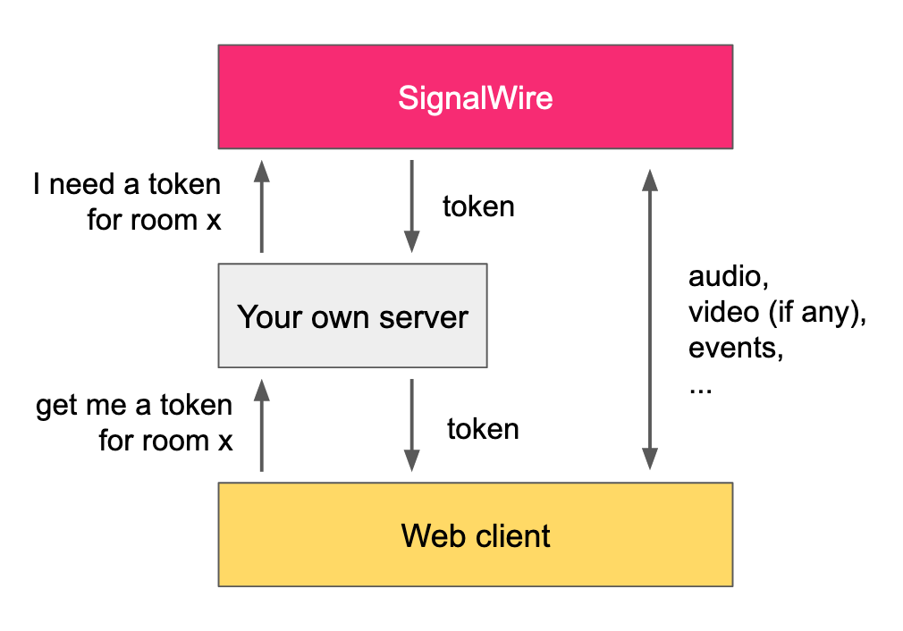

# SignalWire SDK Demo Server

This repository contains a sample implementation of a SignalWire SDK Server. This is the server that you need to securely communicate with SignalWire and to implement your custom authentication logic. This server typically fits between a web browser client and SignalWire infrastructure as illustrated in the picture below:



## Configuration

You need to specify your SignalWire Project ID and other information within the file [`docker-compose.yml`](docker-compose.yml). Please configure the following environment variables, whose values you can find in [your own SignalWire space](https://signalwire.com/signin):

```yaml
  environment:
   - SIGNALWIRE_PROJECT_ID=...
   - SIGNALWIRE_API_TOKEN=...
   - SIGNALWIRE_SPACE_URL=...
```

There is a fourth environment variable, named `MOD_PASSWORD`. You can configure this to set a moderator password (see sections below).

By default, the server listens for connections on `http://localhost:5000`. You can change the port by modifying the mapping in `docker-compose.yml`. For example, to expose the server on port 80 of your host, change the `ports` config to:

```yaml
  ports:
   - 80:5000
```

## How to start this server

In the [`src`](src) directory you can find the minimal implementation of a simple server that is used to acquire authentication tokens. To start the server, you can use Docker Compose by running the following command in your terminal:

```sh
docker compose up
```

After the server is running, you can request tokens from the browser using code such as the following:

```js
const response = await fetch('http://localhost:5000/get_token', {
  method: 'POST',
  headers: {
    'Content-Type': 'application/json'
  },
  body: JSON.stringify({
    user_name: 'guest',
    room_name: 'office',
    mod_password: undefined  // (or MOD_PASSWORD)
  })
})

const token = (await response.json()).token
console.log(token)
```

## What this server implements

The file [src/index.js](src/index.js) implements a very basic authentication mechanism for clients running in the browser. When browser clients request a token for accessing the SignalWire APIs, we may want to return them either a normal token, or a token with moderator permissions (e.g., a token that allows to mute other users in a video room).

With this server, clients have the option to specify a secret password when requesting a token. If the password is correct, the client gets a moderator-level token. Otherwire, it gets a token with normal permissions.

You are encouraged to take a look at the contents of [src/index.js](src/index.js). You can go ahead and change the contents of that file to implement your custom authentication logic.